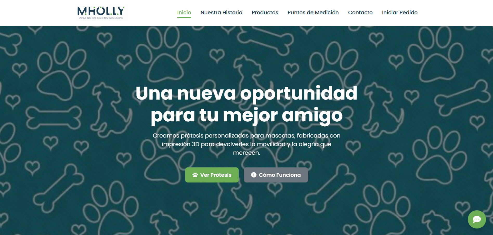
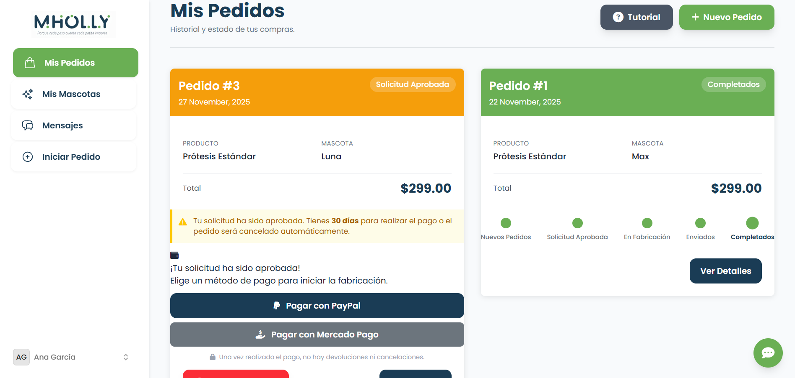
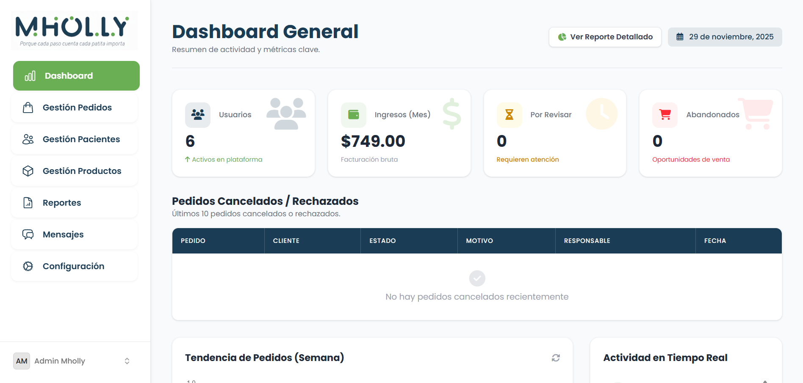

# MHOLLY - E-commerce de Prótesis 3D

  
    
  
  

## Descripción
Plataforma de venta de prótesis para mascotas con personalización de producto y gestión de pacientes.

## Mi Rol: Integración Fintech & Lógica
Desarrollado en **pareja (Participación Igualitaria)**. Mi enfoque fue:
- **Pagos:** Integración de **PayPal SDK** y **MercadoPago SDK**.
- **Seguridad:** Implementación de **2FA** y verificación de identidad.
- **Lógica:** Flujo de "Pedido Inmediato" vs "Pedido Diferido".
- **Comunicación:** Chat asíncrono Cliente-Admin.

## Stack Tecnológico Completo

**Backend & Seguridad**
- Laravel 12.0
- PHP 8.2
- Laravel Fortify (Autenticación Avanzada)
- Google2FA (Autenticación de dos factores)
- Eloquent ORM

**Integraciones & APIs**
- PayPal SDK (srmklive/paypal)
- MercadoPago SDK (mercadopago/dx-php)
- Mailtrap (Sistema de Notificaciones)

**Frontend**
- Livewire Flux 2.1
- Livewire Volt 1.7
- Chart.js (Visualización de datos)
- Blade Heroicons
- TailwindCSS

**Testing & Calidad**
- Pest 4.1
- PHPUnit
- Laravel Pint (Code Styling)

## Capturas

  
  

[Volver](../README.md)